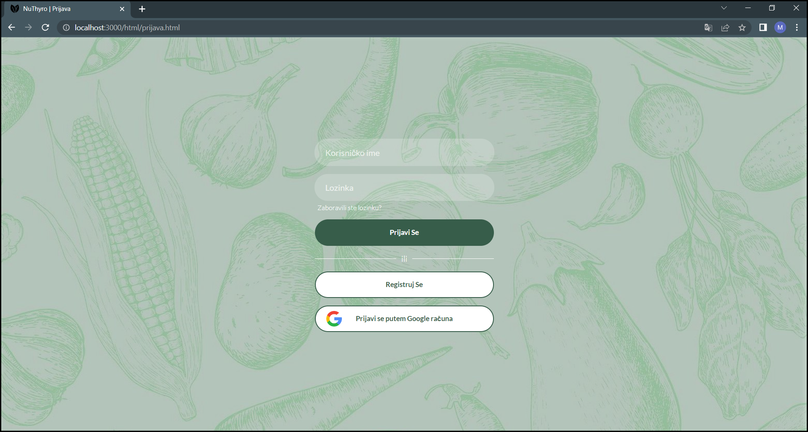
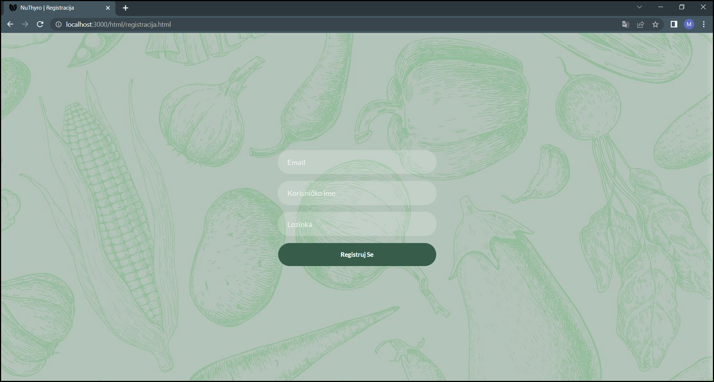
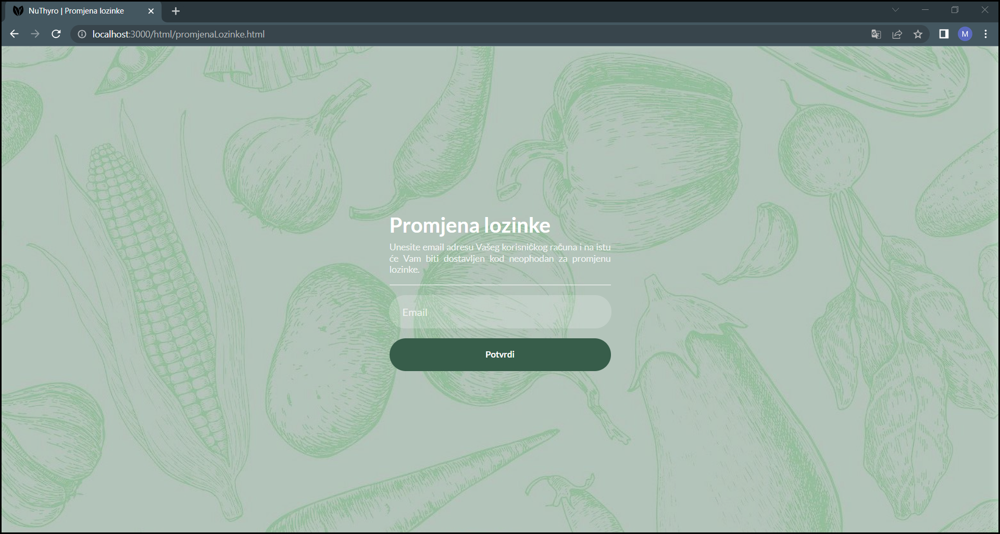
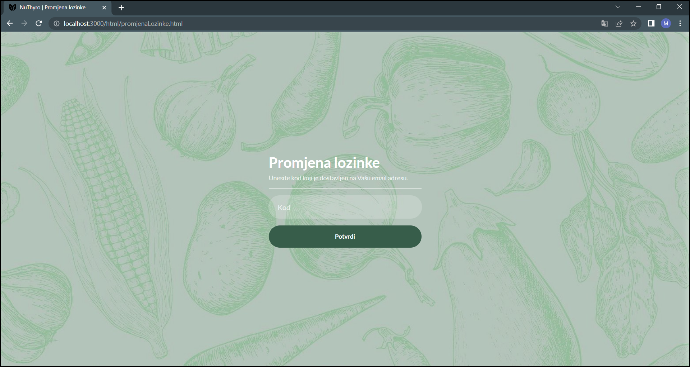
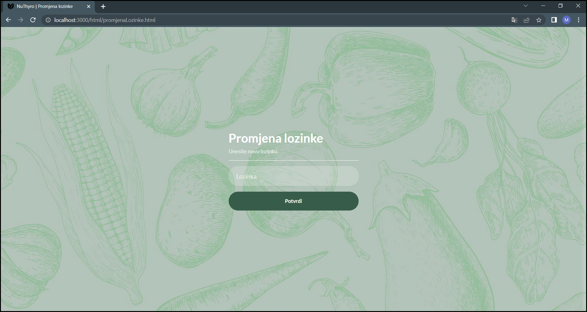
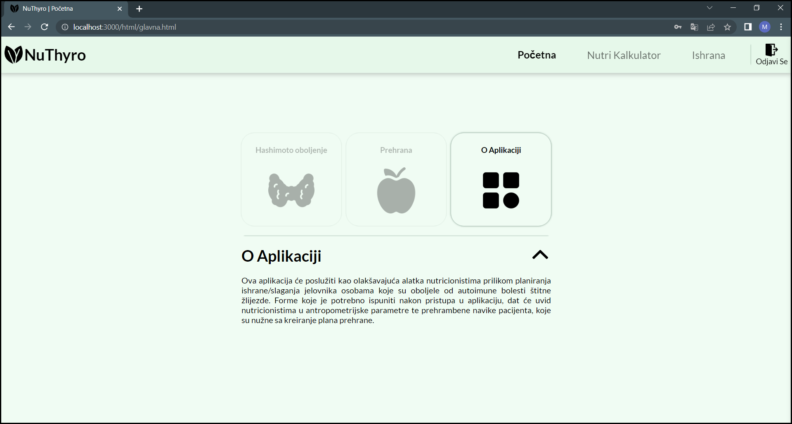

# NuThyro
<p align="justify">
NuThyro is a web application for helping people in diet control. It is intended to be used by people with chronic diseases because of theirs specific diet needs. 
</p>

## Demonstration

### Authentication

#### Sign In
<div align="center">
  
</div>

#### Sign Up
<div>
    
</div>

#### Sing In With Google
<div>
    
</div>

#### Password Update

##### Email Address Input
<div>
    
</div>

##### Auto-generated Email Message
<div>
    
</div>

##### Code Input
<div>
    
</div>

##### New Password Input
<div>
    
</div>

#### Sign Out
<div>
    
</div>

### Home page

#### About Application
<div>
    
</div>

#### About Diet
<div>
    
</div>

#### About Hahimoto Disease
<div>
    
</div>

### Nutri Calculator
<div>
    
</div>

#### Activity Types
<div>
    
</div>

### Diet
<div>
    
</div>

##### Report
<div>
    
</div>

## Execution
<p align="justify">
Some features require a set up of .env file.<br> In application root folder, enter command below to install required packages.
</p>

```bash
npm install
```

<p align="justify">
In application root folder, enter one of the two following commands to run application.
</p>

```bash
node index.js
npm start
```

<p align="justify">
  When the Express.js server is running you can access application by entering 
  <a href="http://localhost:3000/html/prijava.html">http://localhost:3000/html/prijava.html</a> in a web browser.
</p>
